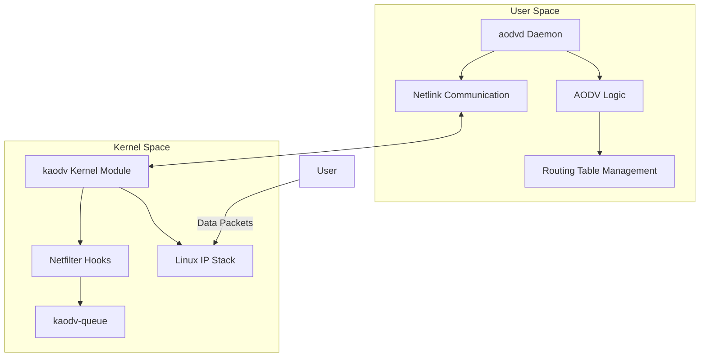
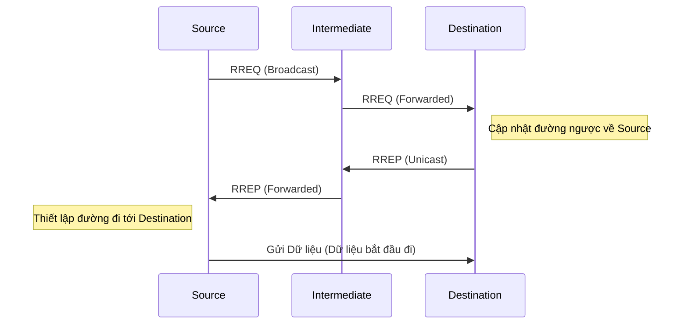

# Phân tích Repository AODV-UU

Tài liệu này tổng kết các kết quả phân tích về repository **AODV-UU** (Ad hoc On-demand Distance Vector - Uppsala University). Đây là một bản cài đặt hoàn chỉnh của giao thức định tuyến AODV cho mạng không dây tùy biến (MANET), được thiết kế để chạy trên Linux.

## 1. Mục đích và Phạm vi

AODV-UU triển khai giao thức định tuyến dựa trên nhu cầu (on-demand). Nó chỉ tìm kiếm đường đi khi một nút nguồn muốn gửi dữ liệu đến một nút đích mà chưa có sẵn đường truyền. Dự án này phục vụ hai mục đích chính:

- **Thực tế**: Chạy như một daemon trên Linux để định tuyến cho các thiết bị thực té.
- **Mô phỏng**: Tích hợp với trình mô phỏng mạng NS-2 để nghiên cứu và đánh giá hiệu năng.

---

## 2. Kiến trúc Hệ thống

Cơ chế hoạt động của AODV-UU dựa trên sự phối hợp giữa hai thành phần chính:

### A. Daemon Không gian người dùng (`aodvd`)

Chịu trách nhiệm xử lý logic của giao thức AODV. Nó quyết định khi nào cần tìm đường, cách xử lý các thông báo lỗi và quản lý bảng định tuyến.

### B. Module Kernel (`kaodv`)

Thực hiện các nhiệm vụ ở cấp thấp:

- **Bắt gói tin**: Sử dụng Netfilter để bắt các gói tin dữ liệu chưa có đường đi.
- **Hàng đợi gói tin**: Giữ các gói tin trong hàng đợi (`kaodv-queue`) trong khi chờ `aodvd` tìm đường.
- **Chèn bảng định tuyến**: Giao tiếp với daemon qua Netlink để cập nhật bảng định tuyến của hệ điều hành.

---

## 3. Phân rã các Module chính

| Module                          | Vai trò chính                                                          | Các file quan trọng                              |
| :------------------------------ | :--------------------------------------------------------------------- | :----------------------------------------------- |
| **Logic cốt lõi**               | Quản lý vòng lặp sự kiện, cấu hình và khởi tạo hệ thống.               | `main.c`, `defs.h`, `params.h`                   |
| **Giao diện Mạng**              | Xử lý việc gửi và nhận các gói tin điều khiển AODV qua UDP (Cổng 654). | `aodv_socket.c/h`                                |
| **Tìm đường (Route Discovery)** | Tạo, gửi và xử lý các thông điệp RREQ (Yêu cầu) và RREP (Phản hồi).    | `aodv_rreq.c`, `aodv_rrep.c`                     |
| **Bảo trì đường truyền**        | Xử lý thông báo lỗi RERR và thông điệp Hello để duy trì lân cận.       | `aodv_rerr.c`, `aodv_hello.c`, `aodv_neighbor.c` |
| **Bản định tuyến**              | Lưu trữ các đường đi, quản lý thời gian hết hạn (timeout).             | `routing_table.c/h`                              |
| **Kernel Bridge**               | Giao tiếp với module nhân Linux qua cơ chế Netlink.                    | `nl.c/h`, `lnx/kaodv-netlink.c`                  |

---

## 4. Luồng hoạt động chính: Tìm kiếm đường đi (Route Discovery)

Khi một nút muốn gửi dữ liệu đến một đích chưa có trong bảng định tuyến:

1. **Phát hiện**: Kernel phát hiện thiếu đường đi và thông báo cho `aodvd`.
2. **Yêu cầu (RREQ)**: `aodvd` tạo gói tin **RREQ** và phát quảng bá (broadcast) tới các hàng xóm.
3. **Chuyển tiếp**: Các nút trung gian nhận RREQ, tạo đường ngược (reverse route) về phía nguồn và tiếp tục quảng bá nếu chưa có đường tới đích.
4. **Phản hồi (RREP)**: Khi RREQ tới đích (hoặc một nút trung gian có đường đi mới tới đích), một gói tin **RREP** được gửi ngược lại về nguồn theo đường đã thiết lập.
5. **Thiết lập**: Nguồn nhận RREP, cập nhật bảng định tuyến và bắt đầu gửi dữ liệu.

---

## 5. Kết luận

AODV-UU là một bản cài đặt mẫu mực, gọn gàng và ổn định của giao thức AODV. Điểm mạnh của nó là khả năng chạy thực tế trên Linux nhờ vào sự tách biệt thông minh giữa logic giao thức (User-space) và việc can thiệp mạng (Kernel-space).
